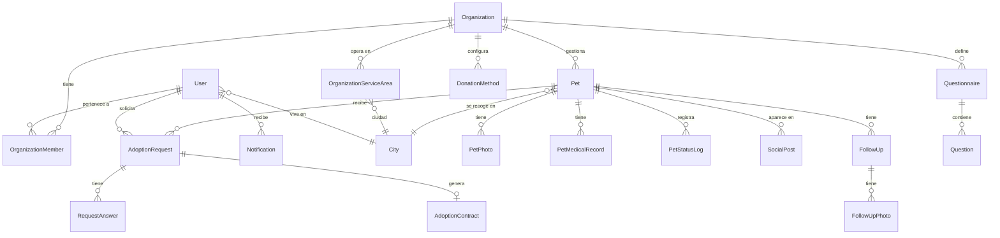
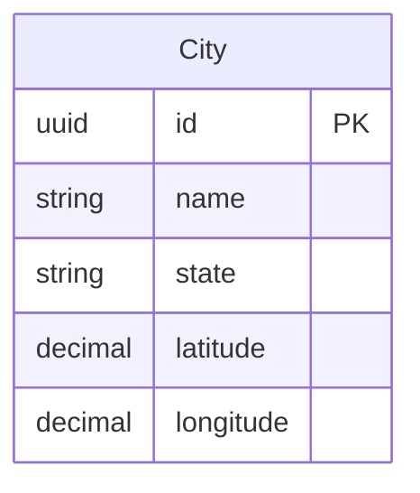
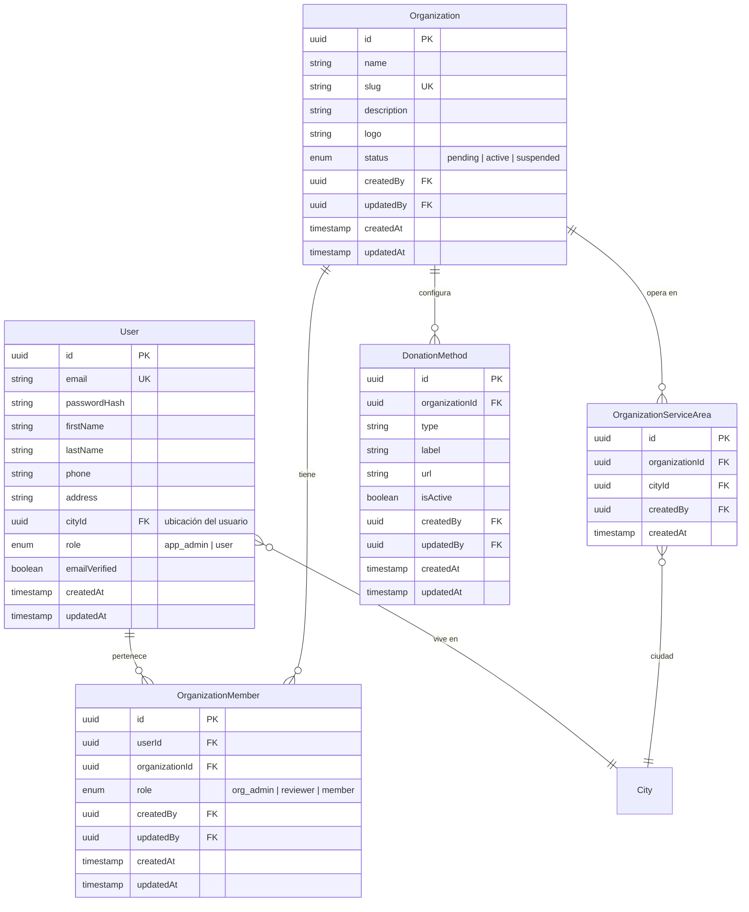
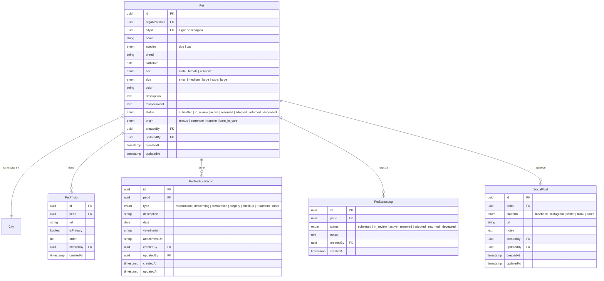
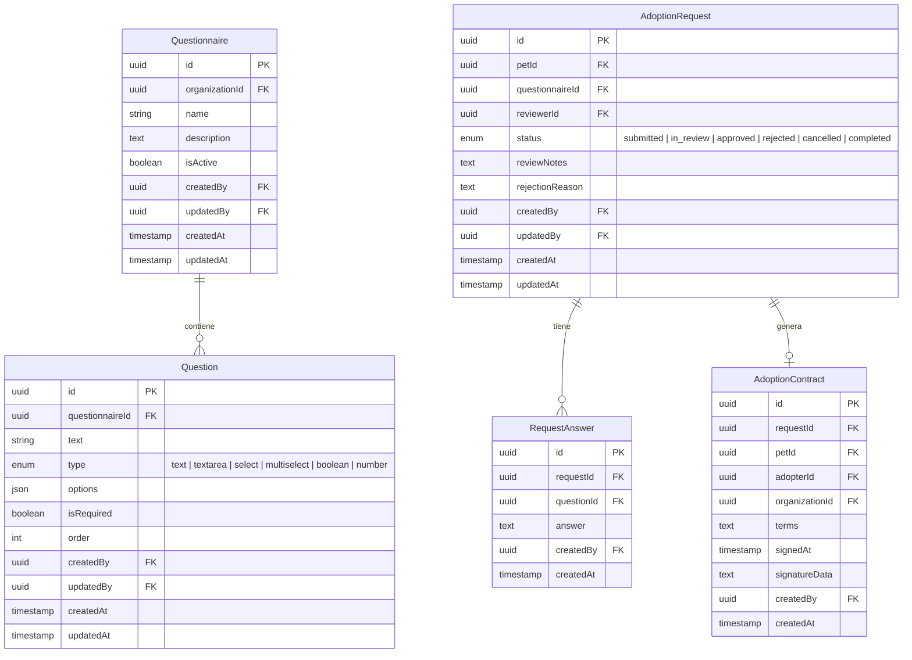
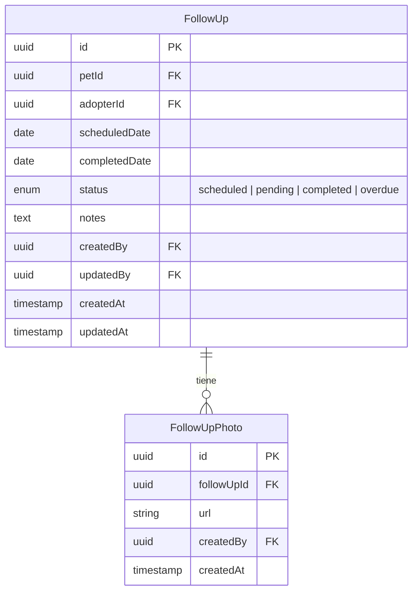
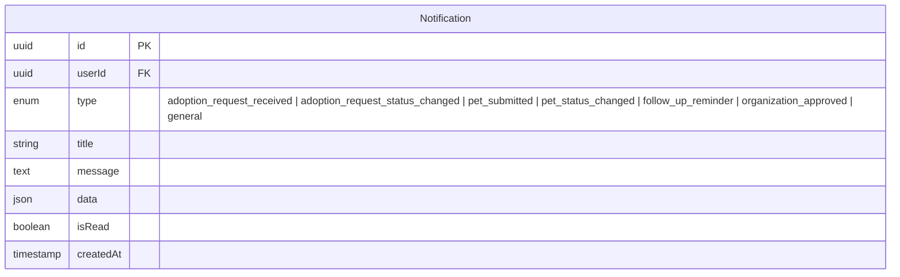
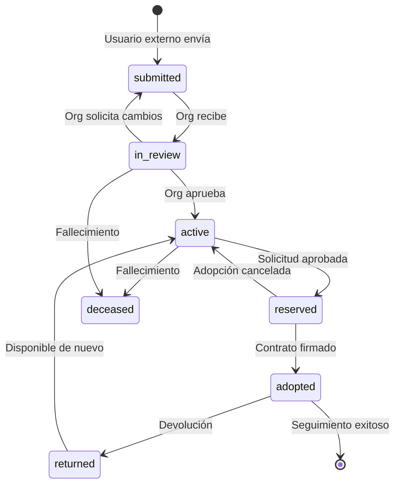
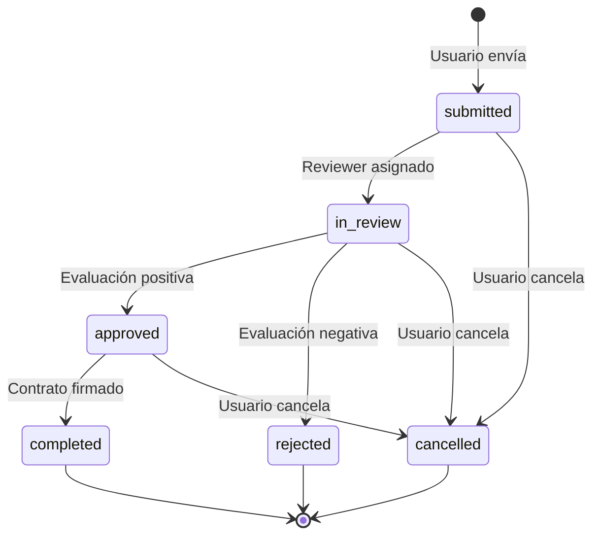

# ConectaPelu2 - Mapa de Entidades

## Diagrama General

## Geografía

### Notas sobre City
- **Datos pre-cargados**: Se cargan ~2,500 municipios de México desde datos oficiales (INEGI)
- **Búsqueda por proximidad**: Las coordenadas permiten calcular distancias entre ciudades
- **Autocompletado**: Los usuarios seleccionan de un dropdown, no escriben libre

---

## Usuarios y Organizaciones

## Mascotas

## Proceso de Adopción

## Seguimiento Post-Adopción

## Notificaciones

## Flujo de Estados

### Estado de Mascota

### Estado de Solicitud de Adopción

---

## Listado de Entidades

### Geografía (1 entidad)

| Entidad | Descripción |
|---------|-------------|
| `City` | Ciudades/municipios con coordenadas (datos pre-cargados) |

### Core (6 entidades)

| Entidad | Descripción |
|---------|-------------|
| `User` | Usuarios de la plataforma (todos los tipos) |
| `Organization` | Organizaciones sin fines de lucro |
| `OrganizationMember` | Relación usuario-organización con rol |
| `OrganizationServiceArea` | Ciudades donde opera cada organización |
| `DonationMethod` | Métodos de donación configurados por org |
| `Notification` | Notificaciones para usuarios |

### Mascotas (5 entidades)

| Entidad | Descripción |
|---------|-------------|
| `Pet` | Mascotas (perros/gatos) |
| `PetPhoto` | Fotos de mascotas |
| `PetMedicalRecord` | Historial médico (vacunas, esterilización, etc.) |
| `PetStatusLog` | Historial de cambios de estado |
| `SocialPost` | Posts en redes sociales relacionados a la mascota |

### Adopción (5 entidades)

| Entidad | Descripción |
|---------|-------------|
| `Questionnaire` | Plantilla de cuestionario pre-adopción (por org) |
| `Question` | Preguntas del cuestionario |
| `AdoptionRequest` | Solicitudes de adopción |
| `RequestAnswer` | Respuestas del adoptante a las preguntas |
| `AdoptionContract` | Contrato de adopción firmado |

### Seguimiento (2 entidades)

| Entidad | Descripción |
|---------|-------------|
| `FollowUp` | Seguimientos post-adopción |
| `FollowUpPhoto` | Fotos de seguimiento |

---

## Enums / Tipos

### UserRole (rol global)
- `app_admin` - Administrador de la plataforma
- `user` - Usuario regular (adoptante, etc.)

### OrgMemberRole (rol dentro de org)
- `org_admin` - Administrador de la organización
- `reviewer` - Revisor de solicitudes
- `member` - Miembro básico

### OrganizationStatus
- `pending` - Pendiente de aprobación
- `active` - Activa
- `suspended` - Suspendida

### PetSpecies
- `dog` - Perro
- `cat` - Gato

### PetStatus
- `submitted` - Enviada por usuario externo (pendiente revisión)
- `in_review` - En revisión por la org
- `active` - Activa/publicada (disponible para adopción)
- `reserved` - Reservada (en proceso de adopción)
- `adopted` - Adoptada
- `returned` - Devuelta
- `deceased` - Fallecida

### PetOrigin
- `rescue` - Rescate
- `surrender` - Entrega voluntaria
- `transfer` - Transferencia de otra org
- `born_in_care` - Nacida en cuidado

### PetSize
- `small` - Pequeño
- `medium` - Mediano
- `large` - Grande
- `extra_large` - Extra grande

### PetSex
- `male` - Macho
- `female` - Hembra
- `unknown` - Desconocido

### AdoptionRequestStatus
- `submitted` - Enviada
- `in_review` - En revisión
- `approved` - Aprobada
- `rejected` - Rechazada
- `cancelled` - Cancelada por el usuario
- `completed` - Completada (adoptado)

### QuestionType
- `text` - Texto libre
- `textarea` - Texto largo
- `select` - Selección única
- `multiselect` - Selección múltiple
- `boolean` - Sí/No
- `number` - Número

### MedicalRecordType
- `vaccination` - Vacunación
- `deworming` - Desparasitación
- `sterilization` - Esterilización
- `surgery` - Cirugía
- `checkup` - Chequeo general
- `treatment` - Tratamiento
- `other` - Otro

### FollowUpStatus
- `scheduled` - Programado
- `pending` - Pendiente de respuesta
- `completed` - Completado
- `overdue` - Atrasado

### SocialPlatform
- `facebook` - Facebook
- `instagram` - Instagram
- `twitter` - Twitter/X
- `tiktok` - TikTok
- `other` - Otra

### NotificationType
- `adoption_request_received`
- `adoption_request_status_changed`
- `pet_submitted`
- `pet_status_changed`
- `follow_up_reminder`
- `organization_approved`
- `general`

---

## Total: 19 Entidades

Organizadas para implementación incremental según los milestones del roadmap.
